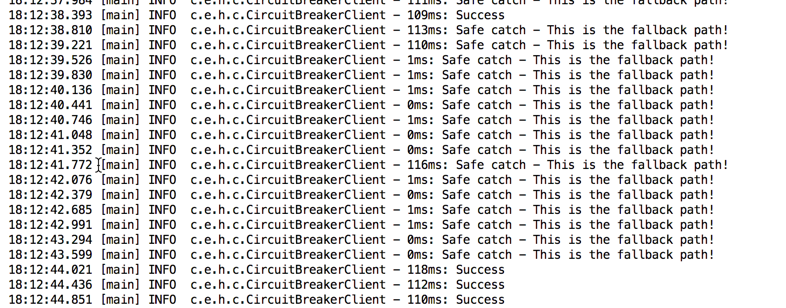

Hystrix circuit breaker
============================

1. Read circuit breaker overview [https://github.com/Netflix/Hystrix/wiki/How-it-Works#CircuitBreaker](https://github.com/Netflix/Hystrix/wiki/How-it-Works#CircuitBreaker)
* Protecting the downstream from bombarding
* Self-protection
* Scale and fail-fast predictabilty 

2. Open module hystrix-servers and if ServersApplication is not running then please run ServersApplication application

3. Create RemoteServiceCircuitBreakingCommand as we did in previous modules

4. Use RemoteServiceCircuitBreakingCommand at CircuitBreakerClient->callRemoteService()
```
new RemoteCircuitBreakerCommand(SERVICE_PATH).execute();
```

5. Run CircuitBreakerClient main function, in console you should see fallback responses


6. Go to resources -> [config.properties](src/main/resources/config.properties), and review properties

Read about configurations at [https://github.com/Netflix/Hystrix/wiki/Configuration#CommandCircuitBreaker](https://github.com/Netflix/Hystrix/wiki/Configuration#CommandCircuitBreaker) 

7. Hystrix Dashboard:
http://localhost:8080/hystrix/monitor?stream=http%3A%2F%2Flocalhost%3A9090%2Fhystrix.stream&title=Test

Note: Reload the above page just after running TimeoutClient main function in case you don't see dashboard updating

Dashboard more details: [https://github.com/Netflix/Hystrix/wiki/Dashboard](https://github.com/Netflix/Hystrix/wiki/Dashboard)


8. Reading material:
* [https://github.com/Netflix/Hystrix/wiki/How-it-Works](https://github.com/Netflix/Hystrix/wiki/How-it-Works)
* [Introduction to Hystrix blog](http://www.baeldung.com/introduction-to-hystrix)
* [ebay - Application Resiliency Using Netflix Hystrix](http://www.ebaytechblog.com/2015/09/08/application-resiliency-using-netflix-hystrix/)
